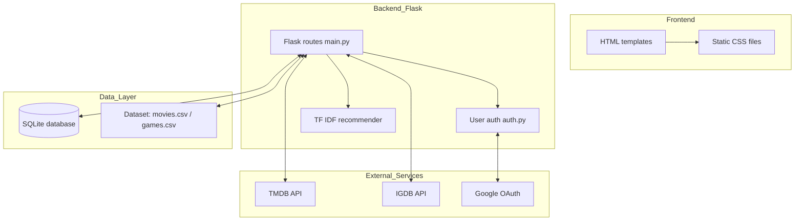

# Dokumentacja Architekturalna

## Widok komponentów
Aplikacja została zaprojektowana w architekturze **Monolithic with External Service Gateways**, tzn. aplikacja działa jako jeden spójny monolit, w którym cała logika znajduje się w jednym projekcie. Komunikacja z usługami zewnętrznymi odbywa się przez wydzielone bramy, które porządkują i izolują integracje z zewnętrznymi API.

>[!NOTE] Model Monolityczny z Bramami 
>Aplikacja działa jako spójny monolit, co ułatwia zarządzanie stanem sesji i bazą danych. Komunikacja z usługami zewnętrznymi (TMDB, IGDB, Google) jest izolowana w folderze `algorytmy/`, co pozwala na łatwą wymianę dostawcy danych w przyszłości bez ingerencji w kod serwera Flask.